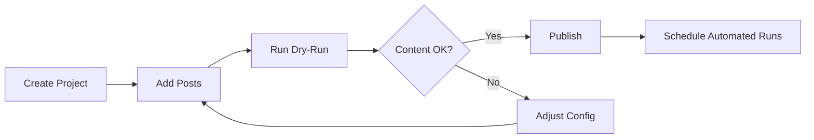

# Quick Start Guide

Get the Content Creator up and running in minutes!

## Prerequisites Checklist

- [x] Node.js 18+ installed
- [ ] Supabase account created
- [ ] OpenAI API key obtained
- [ ] SerpAPI key obtained
- [ ] Unsplash API key obtained

## 5-Minute Setup

### 1. Install Dependencies ✅

```bash
npm install
```

**Status**: Already completed!

### 2. Configure Environment Variables

```bash
cp .env.example .env
```

Edit `.env` with your credentials:

```env
SUPABASE_URL=https://your-project.supabase.co
SUPABASE_SERVICE_ROLE_KEY=your-service-role-key
OPENAI_API_KEY=sk-...
SERPAPI_KEY=...
UNSPLASH_ACCESS_KEY=...
```

### 3. Set Up Supabase Database

1. Go to [Supabase Dashboard](https://app.supabase.com)
2. Navigate to **SQL Editor**
3. Run these migration files in order:
   ```
   migrations/001_create_projects_table.sql
   migrations/002_create_posts_table.sql
   migrations/003_create_logs_table.sql
   ```

### 4. Build the Project ✅

```bash
npm run build
```

**Status**: Already completed!

### 5. Create Your First Project

In Supabase SQL Editor, run:

```sql
INSERT INTO projects (name, platform_type, endpoints, auth_config, parameters, style_config)
VALUES (
  'My First Blog',
  'custom-backend-v1',
  '{"publish": "https://api.example.com/posts"}',
  '{"token": "your-api-token"}',
  '{}',
  '{"tone": "professional", "length": "medium", "includeImages": true}'
);
```

### 6. Add Your First Post

```sql
INSERT INTO posts (
  project_id,
  title,
  field_niche,
  keywords,
  publish_date
)
VALUES (
  (SELECT id FROM projects WHERE name = 'My First Blog' LIMIT 1),
  'The Future of AI in Web Development',
  'Web Development',
  ARRAY['AI', 'web development', 'automation'],
  CURRENT_DATE
);
```

### 7. Test with Dry Run

```bash
npm run cli publish --dry-run
```

This will:
- ✓ Research the topic using SerpAPI
- ✓ Generate content using OpenAI
- ✓ Find relevant images from Unsplash
- ✓ Save the content to database
- ✗ Skip actual publishing (dry-run mode)

### 8. Verify Generated Content

Check the `posts` table in Supabase:

```sql
SELECT id, title, status, content_json
FROM posts
WHERE title = 'The Future of AI in Web Development';
```

## Next Steps

### Option A: Publish Now

```bash
npm run cli publish
```

### Option B: Set Up Automated Publishing

```bash
# Start the scheduler (runs daily at midnight)
npm run schedule
```

Or customize the schedule in `.env`:

```env
CRON_SCHEDULE="0 9 * * *"  # Daily at 9 AM
```

### Option C: Create a Custom Adapter

See [`docs/ADAPTER_GUIDE.md`](docs/ADAPTER_GUIDE.md) for detailed instructions on creating adapters for WordPress, Ghost, Medium, or any custom platform.

## Troubleshooting

### "Missing required environment variables"

- Make sure you've created `.env` from `.env.example`
- Verify all required API keys are set

### "Failed to get projects"

- Run the database migrations in Supabase
- Check that your Supabase credentials are correct

### "Research search failed"

- Verify your SerpAPI key is valid
- Check you haven't exceeded the free tier limit (100 searches/month)

### "Content generation failed"

- Verify your OpenAI API key is correct
- Ensure you have credits in your OpenAI account
- Check that the model (gpt-4o) is available for your account

## Project Structure

```
content-creator/
├── dist/               # Compiled JavaScript (generated) ✅
├── src/
│   ├── adapters/       # Platform adapters ✅
│   ├── services/       # Core business logic ✅
│   ├── types/          # TypeScript types ✅
│   ├── utils/          # Utility functions ✅
│   ├── cli.ts          # Command-line interface ✅
│   ├── scheduler.ts    # Cron scheduler ✅
│   └── index.ts        # Main exports ✅
├── migrations/         # Database SQL files ✅
├── docs/               # Documentation ✅
├── .env.example        # Environment template ✅
├── package.json        # Dependencies ✅
├── tsconfig.json       # TypeScript config ✅
└── README.md           # Full documentation ✅
```

## Available Commands

```bash
# Development
npm run dev              # Watch mode
npm run build            # Compile TypeScript

# Publishing
npm run cli publish      # Publish pending posts
npm run cli publish -d   # Dry run (no actual publishing)
npm run cli publish -p "Blog Name"  # Specific project

# Stats
npm run cli stats        # Show statistics

# Scheduling
npm run schedule         # Start automated scheduler
```

## What's Happening Under the Hood?

When you run `publish`, the system:

1. **Queries Database** - Finds posts with `status='pending'` and `publish_date <= today`
2. **Performs Research** - Uses SerpAPI to find up-to-date information
3. **Synthesizes Findings** - AI analyzes research and extracts key insights
4. **Generates Content** - Creates full blog post with proper structure
5. **Adds Images** - Searches Unsplash for relevant visuals
6. **Validates** - Ensures content meets quality standards
7. **Publishes** - Sends to platform using the configured adapter
8. **Updates Database** - Marks post as published with URL

All with automatic retry logic and comprehensive logging!

## Cost Breakdown

For **30 posts/month**:

- OpenAI (GPT-4o): ~$0.30-1.50/month (PAID)
- SerpAPI: Free tier (100 searches/month)
- Unsplash: Free tier (50 requests/hour)
- Supabase: Free tier (500MB database)

**Total: ~$0.30-1.50/month**

## Getting Help

- 📖 Full documentation: [`README.md`](README.md)
- 🔧 Adapter guide: [`docs/ADAPTER_GUIDE.md`](docs/ADAPTER_GUIDE.md)
- 🗄️ Database migrations: [`migrations/README.md`](migrations/README.md)

## Example Workflow



Happy publishing! 🚀
